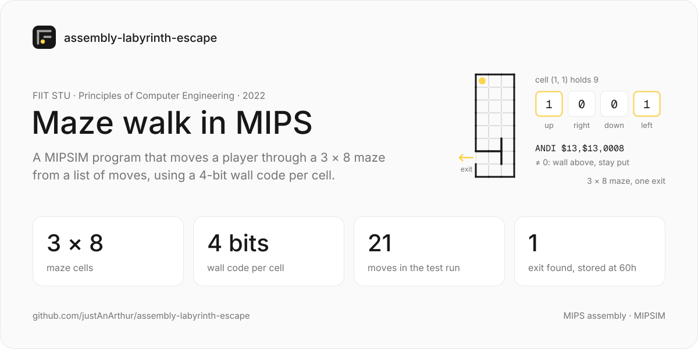
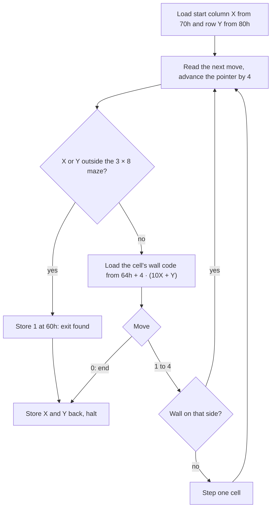

# Maze walk in MIPS

A MIPS assembly program for the MIPSIM simulator that moves a player through a 3 × 8 maze, following a list of moves in data memory, and records whether the player got out. Built for Principles of Computer Engineering (assignment 5, task 23) at FIIT STU in autumn 2022.

> Finished and archived. In the report's test run the player starts at (1, 1), follows a 21-move sequence and leaves the maze through its one exit, so 60h ends up holding 1.

## What it does

- Stores each cell's walls as a 4-bit code (up, right, down, left): cell (1, 1) has walls above and to the left, so it holds `1001` = 9. The 24 codes sit in data memory from 90h to fch
- Reads the moves as words every 4 bytes from 0h: 1 up, 2 right, 3 down, 4 left, 0 end
- Before each move, loads the current cell's code from 64h + 4 · (10X + Y) and tests the wall on that side with `ANDI`; a move into a wall leaves the player where they are
- Treats a coordinate outside the maze as the exit: writes 1 to 60h, then writes the final column X and row Y back to 70h and 80h (the brief asked for a0h and b0h)
- Puts NOPs between dependent instructions for MIPSIM's pipeline, which the brief asks to use as well as possible

## How it works

The encoded map, row Y by column X, as the report gives it:

| Y \ X | 1 | 2  | 3  |
|-------|---|----|----|
| 1     | 9 | 8  | 12 |
| 2–5   | 1 | 0  | 4  |
| 6     | 3 | 6  | 5  |
| 7     | 8 | 12 | 5  |
| 8     | 3 | 2  | 6  |

The cell in column 1, row 7 has no wall on its left: that is the exit.

## Results

The report's test run, with the files in [resenie/mipsim/](resenie/mipsim):

| Test run                  | Value                                         |
|---------------------------|-----------------------------------------------|
| Start (X, Y)              | (1, 1)                                        |
| Moves                     | `1 2 2 2 2 3 3 3 3 3 3 3 3 3 1 3 4 4 1 4 2 0` |
| 60h after the run         | 1 (exit found)                                |
| 70h (X), 80h (Y) after it | 0, 7                                          |

Data memory layout: moves at 0h–5ch, result at 60h, X and Y at 70h and 80h, the map at 90h–fch. Registers R1–R4 hold the constants 1–4, R9 holds 9 and R10 holds ah.

## Run

Open MIPSIM and load the three files in [resenie/mipsim/](resenie/mipsim): `main.mp` (program), `main.mr` (registers) and `main.md` (data memory with the moves, start position and map). Run it, then read 60h, 70h and 80h.

## Stack

MIPS assembly for the MIPSIM simulator. Report in Word.

## Documentation

- [resenie/main.pdf](resenie/main.pdf): the report (Slovak): maze, wall encoding, commented listing, memory layout, test run; [resenie/main.docx](resenie/main.docx) is its source
- [resenie/mipsim/](resenie/mipsim): program, register and data memory files for MIPSIM
- [Zadanie5_Artur_Kozubov.zip](Zadanie5_Artur_Kozubov.zip): the submitted archive (`resenie/`)
- [zadanie5.pdf](zadanie5.pdf): the course's brief for assignment 5
- [2022_vzor_priklad_MIPSIM_pohyb_po_sachovnici.docx](2022_vzor_priklad_MIPSIM_pohyb_po_sachovnici.docx) with its `.mp` and `.mr`: the course's sample solution, a player on a 5 × 5 board

## License

[CC BY-NC-ND 4.0](LICENSE): share it with credit, but no changes and no commercial use. Don't hand it in as your own coursework. The course's brief and sample (`zadanie5.pdf`, `2022_vzor_priklad_MIPSIM_pohyb_po_sachovnici.*`) belong to their authors and aren't covered.

---

## Pôvodná dokumentácia (SK)

